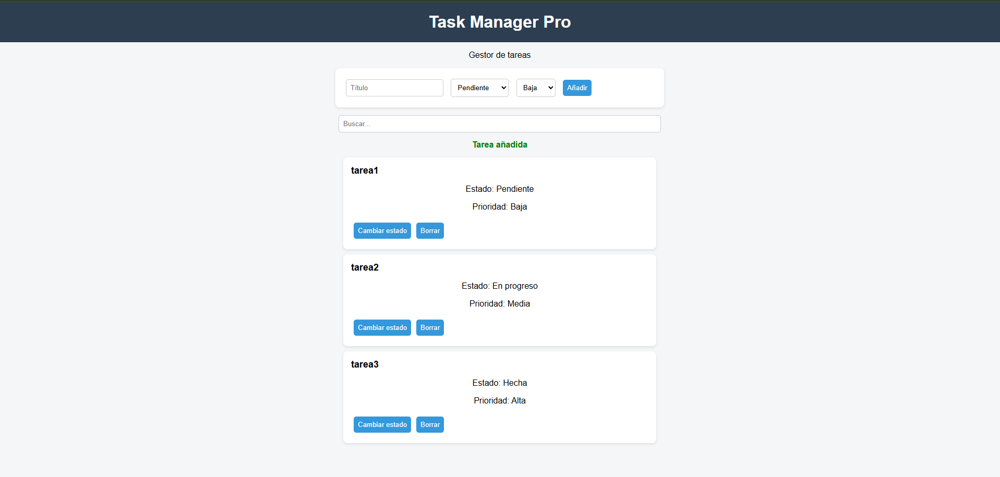
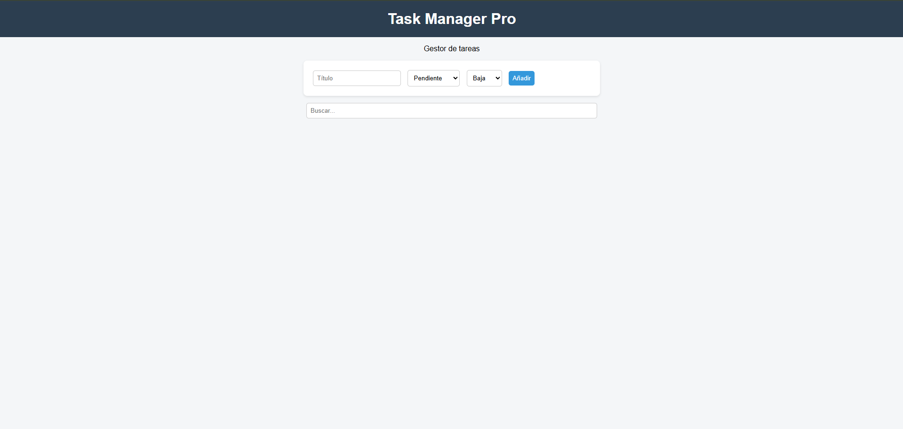

# Task Manager Pro

## Opción elegida
Opción A – Gestor de tareas

## Funcionalidades
- Añadir tareas
- Eliminar tareas
- Cambiar estado
- Búsqueda
- Validación

## Instrucciones
1. Añadir tarea
2. Cambiar estado
3. Borrar tarea
4. Buscar tareas

## Capturas

## Fuentes
No usadas
